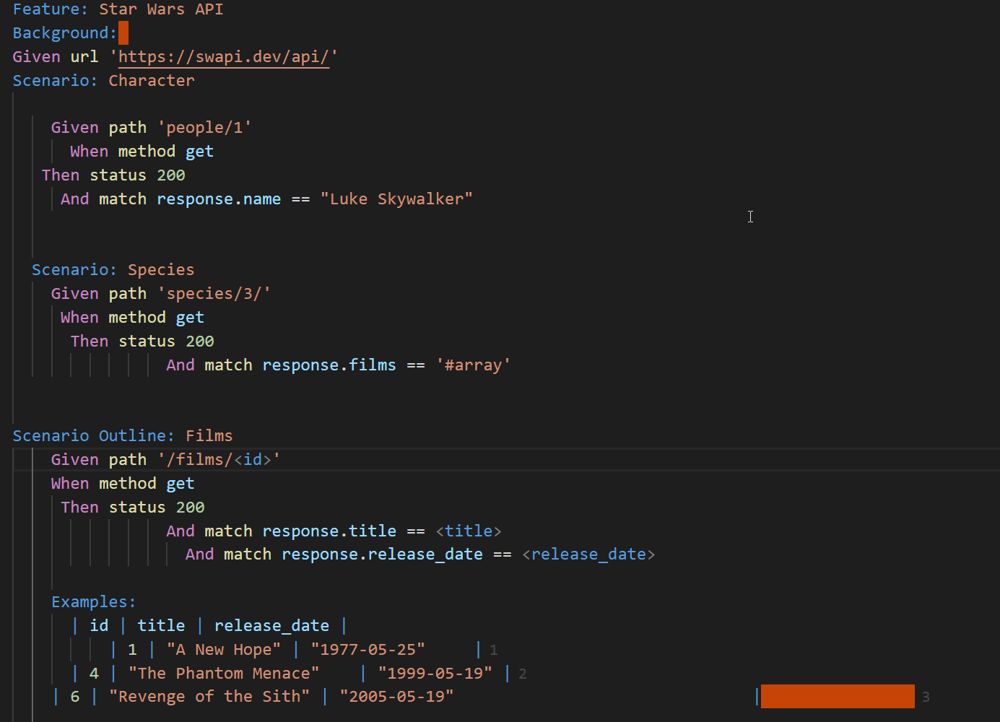

# karate-formatter for VSCode

This extension allows formatting of Karate Feature files.

## Features

- Document format support, including tables formatting



## Requirements

- [Cucumber (Gherkin) Full Support](https://marketplace.visualstudio.com/items?itemName=alexkrechik.cucumberautocomplete) must be installed

## How to use

- Install extension
- Open command palette
  - Mac: Cmd + Shift + P
  - Linux/Windows: Ctrl + Shift + P
- Type and run `Karate Formatter: Format`

## Extension Settings

Default format config:

```json
{
    "Ability": 0,
    "Business Need": 0,
    "Feature:": 0,
    "Scenario:": 1,
    "Background:": 1,
    "Scenario Outline:": 1,
    "Examples:": 2,
    "Given": 2,
    "When": 2,
    "Then": 2,
    "And": 2,
    "But": 2,
    "\\*": 2,
    "\\|": 3,
    "\"\"\"": 3,
    "#": "relative",
    "@": "relative"
  }
```

Override single values by adding them to `.vscode/settings.json`\
(If file does not exist, run `mkdir .vscode && touch .vscode/settings.json` in terminal.)

e.g.
```json
"cucumberautocomplete.formatConfOverride": {
  "Feature:": 2,
}
```
